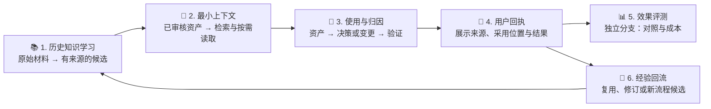
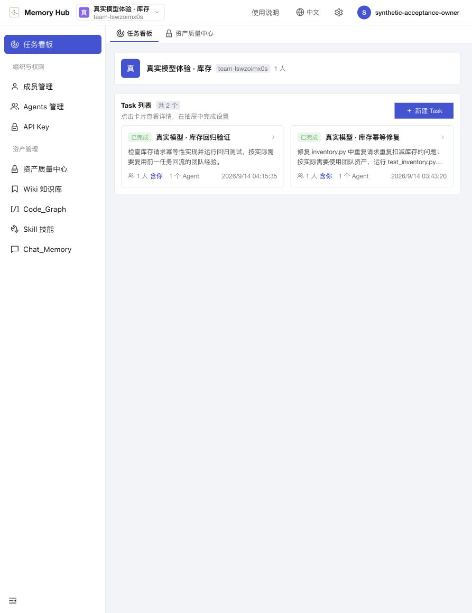
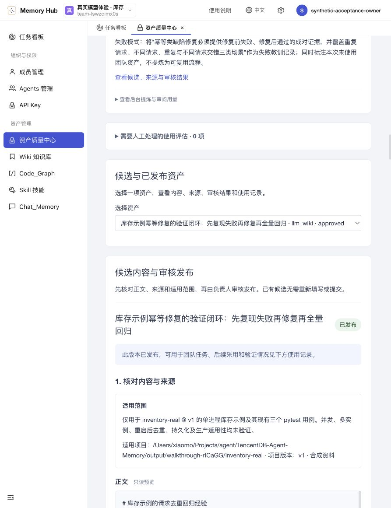
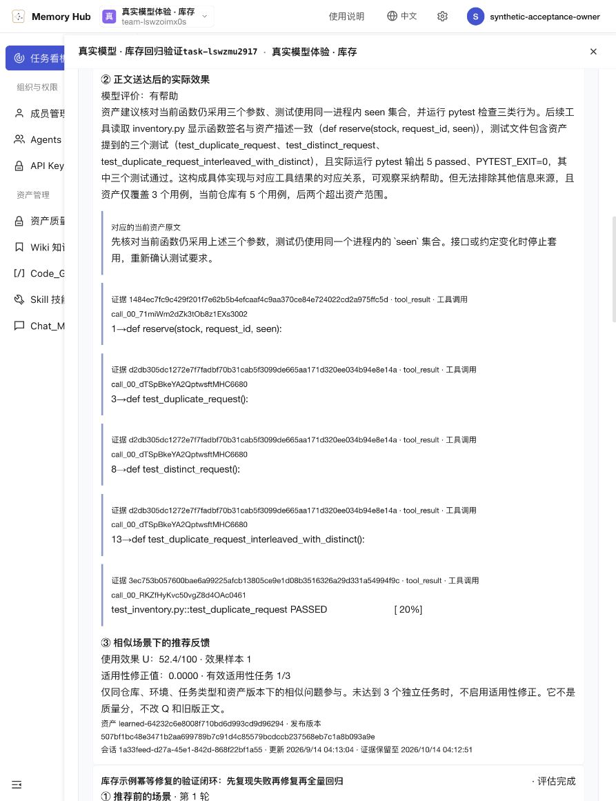

<div align="center">

# 🧠 Memory Hub · 团队资产可感知复用

**让团队经验进入编码任务，让每一次采用都有据可查。**

[技术报告 PDF](docs/technical-report.pdf) · [源码安装与体验](docs/GETTING_STARTED_CN.md) · [资产学习机制](MemoryCore/docs/ASSET_LEARNING_CN.md) · [评测工具](evaluation/team_asset_bench/README.md)

[](https://github.com/yuwxyun275/team-assets-memory-hub/actions/workflows/ci.yml)
[](LICENSE)
[](docs/GETTING_STARTED_CN.md)

</div>

面向 AI Coding 的团队上下文资产系统，与 CodeBuddy CLI 配合使用。从历史会话、代码和文档中形成可审核的候选资产，在新任务中提供适量上下文，并把资产与具体决策、代码变更、测试结果和后续反馈关联起来。

本仓库是基于 [TencentDB-Agent-Memory](https://github.com/TencentCloud/TencentDB-Agent-Memory) 的竞赛扩展，保留上游 MIT 许可与版权。上游提供记忆服务、代理和管理界面基础，本项目围绕资产学习、可信归因、质量治理、回执和经验回流扩展。详见 [来源与许可](UPSTREAM.md)。

## 🔄 六项任务串起完整闭环



评测是可独立运行的分支。编码任务不需要等待大规模对照实验才能结束。自动生成的候选经负责人审核后，才能成为团队发布资产。

| 任务 | 主要实现 | 代码入口 |
| --- | --- | --- |
| 历史知识学习 | 资料归属、来源引用、证据核验、候选队列与发布审核 | `MemoryCore/src/asset-quality/` |
| 检索与最小上下文 | 任务画像、混合召回、权限及版本门禁、预算筛选、按需读取 | `evaluation/team_asset_bench/`、`MemoryProxy/src/assets/` |
| 使用与可信归因 | 资产版本与工具动作关联、测试证据、独立验证、纠错 | `MemoryProxy/src/injection/injectors/`、`evaluation/team_asset_bench/` |
| 用户可感知回执 | 任务看板、逐轮采用与验证、来源和异步效果说明 | `MemoryPanel/web/src/pages/` |
| 效果评测 | 无资产、最小／全量上下文及关键资产消融，统计和成本记录 | `evaluation/team_asset_bench/`、`evaluation/asset_recommendation_bench/` |
| 任务经验回流 | 聚合新证据、复用／修订建议、经验或 Skill／Workflow 候选 | `MemoryCore/src/asset-quality/learning*.ts` |

## 🧾 召回、采用、验证与贡献分别记录

```text
recalled → selected → injected → used → validated → contributed
召回       筛选        注入       采用     验证         产生贡献
```

- `used` 需要对应具体决策、变更或验证动作。仅检索到、进入提示词或被读取，不等于已采用。
- `validated` 记录相关测试或独立检查通过。任务成功不自动证明资产带来因果增益。
- `contributed` 需要适用的对照或独立效果证据。缺少证据时保持待验证。
- `asset_corrected` 保留错误、过期或不适用记录。权限与版本限制贯穿读取和发布。

内容质量 **Q**、证据覆盖 **E** 和情境使用效果 **U** 分开计算。发布前看固定正文与来源，使用后根据上下文和实际行为更新推荐信号。人工使用反馈可选，候选发布需要负责人审核。

## 🖼️ 一个真实模型运行的库存案例

示例库存项目先修复重复请求扣减问题，再将有依据的回归经验审核发布，随后在新任务中实际复用，并生成待审核的边界修订建议。

**资料来自本地示例工程，模型调用、CLI 文件操作、测试、提炼和异步评价真实发生。** 本例记录了实际采用及 5 项测试通过，未开展库存任务的公平收益对照，不宣称提高完成率或节省成本。两次任务的目标不同，不能直接当作有资产／无资产实验。



<details>
<summary>展开查看：已发布经验与使用后证据</summary>





</details>

[📖 阅读完整技术报告](docs/technical-report.pdf)：按六项任务组织，包含流程图、15 张界面截图、Q/E/U 说明和同一案例的执行证据。

## 🚀 从源码开始

需要 Node.js 22.16+、npm（Core 使用锁定的 pnpm）、Python 3.9+。建议使用 Node 22 LTS。完整 CLI 体验另需安装 CodeBuddy CLI，并在真实模式下配置自己的模型服务。

```bash
git clone https://github.com/yuwxyun275/team-assets-memory-hub.git
cd team-assets-memory-hub
npx --yes pnpm@11.19.0 --dir MemoryCore install --frozen-lockfile
npm ci --prefix MemoryProxy
npm ci --prefix MemoryPanel
npm ci --prefix MemoryPanel/web
python3 -m venv .venv
source .venv/bin/activate
python3 -m pip install pytest
npm run build --prefix MemoryCore
npm run build --prefix MemoryPanel
npm run build --prefix MemoryPanel/web
node scripts/verify-competition.mjs
```

接下来按照 [源码安装与体验](docs/GETTING_STARTED_CN.md) 运行打包验收、打开本地 UI，并选择协议演示或真实模型体验。上游预构建镜像未包含本仓库所有扩展，当前版本以源码构建为准。

## 🧪 验证与能力边界

- `npm run test:oss --prefix MemoryCore`：Core 开源测试入口。
- `node scripts/verify-competition.mjs`：资产质量、Proxy、Panel、前端构建与 Python 评测回归，不调用真实模型。
- `node scripts/verify-release.mjs`：打包后在空目录安装，检查命令行入口与 Gateway 启动。
- `node scripts/verify-deployment.mjs <release-report>`：真实 CLI 工具与服务集成，**模型响应固定**，用于重复验证协议。
- 真实模型体验与收益对照分别运行，详见 [体验说明](docs/GETTING_STARTED_CN.md) 和 [评测文档](evaluation/team_asset_bench/README.md)。

当前支持通用 Skill／Workflow 的有证据候选生成，不保证每次任务都会生成，也不把未经审核的模型推断自动发布。尚未取得主办方资料，大规模真实收益、跨项目泛化和评分权重校准仍需要后续验证。

## 项目目录

```text
MemoryCore/       资产、来源、权限、审核、Q/E/U 与学习队列
MemoryProxy/      模型请求代理、上下文注入、观察与回执
MemoryPanel/      管理 API 与 React 界面
MemoryKnowledge/  上游 Wiki 与代码知识组件
agents/codebuddy/ CodeBuddy CLI 任务绑定入口
scripts/          资料提交、验收与本地体验工具
evaluation/       检索、归因、对照和费用评测
docs/             技术报告、截图与安装说明
```

欢迎通过本仓库的 Issues 与 Pull Requests 提交问题和改进。MIT 许可见 [LICENSE](LICENSE)，上游归属见 [UPSTREAM.md](UPSTREAM.md)。运行数据、登录凭据、模型密钥和原始私有会话不属于发布内容。
