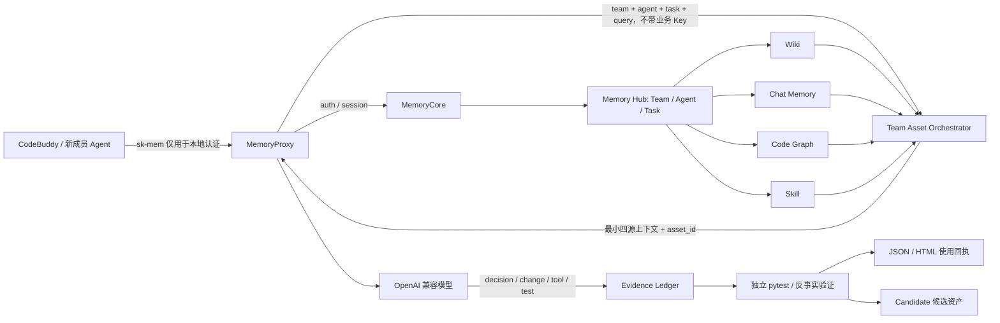

# 面向 AI Coding 的团队资产可感知复用系统：设计与验收

## 1. 交付结论

本方案不再把题目理解成“给单个 Session 做一次向量召回”，而是把它实现为一个团队级决策与证据系统：不同角色贡献不同种类的资产；新成员 Agent 只能看到所属团队、权限允许、版本兼容且经过治理的最小上下文；资产必须影响具体行动并通过独立验证，才能声明有效；任务结束只生成待审核候选，不能自动成为团队权威。

本次选择一个 Python 多租户 Feature Flag 仓库做精品纵向闭环。它同时具备产品边界、历史故障、代码定位和验证流程四类互补信息，单一来源无法稳定完成任务，因此能真正体现“团队”价值。

## 2. 为什么这样拆分系统



组件决策如下：

| 组件 | 本次处理 | 原因 |
| --- | --- | --- |
| Memory Hub | 复用现有 Team、Agent、Task 和四类资产页面；扩展 Task 详情中的“团队资产使用回执”；运行时新增精品团队与四角色 | 把证据放回用户工作的真实控制面，而不是只放在旁路 HTML 报告里 |
| MemoryCore | 复用 `sk-mem` 认证与 Meta API；新增候选审核/发布/拒绝和 `action=use` 状态硬门禁 | 让 candidate 真正进入团队治理流程，而不是只落一个旁路 JSON |
| MemoryProxy | 新增可选 `team-assets` 注入器、自动证据观察器、配置、启动开关与故障放行 | Proxy 是 CodeBuddy Session、模型上下文与工具回包的唯一真实交界面 |
| Python 编排器 | 新增来源治理、ACL、版本/可信度门禁、最小选择、证据账本、评测和回流 | 这些是题目要求的竞赛差异能力，独立模块便于主办方替换私有数据 |

这使改动集中在“资产真正进入 Coding Agent 的边界”，同时保留开源项目升级能力。编排器故障时 Proxy 返回空块并继续请求，不把评测组件变成线上单点。

## 3. 团队不是标签，而是互补知识生产关系

精品团队包含四个角色：

| 角色 | 贡献来源 | 对新任务的不可替代价值 |
| --- | --- | --- |
| 架构/产品约束维护者 | Wiki | 规定同租户、published-only 等权威业务边界 |
| 资深后端工程师 | 历史 Chat Memory | 提供 Redis 故障中的重试风暴失败经验 |
| 代码所有者/静态分析 | Code Graph | 定位最小修改边界，减少重复读文件和搜索 |
| QA/SRE | Skill | 固化正常、故障、隔离、恢复的一体化验证流程 |
| 新成员后端工程师 | CodeBuddy 执行 Agent | 在不了解历史的前提下消费团队资产并完成新任务 |

数据集中另放入无关日志经验、过期全局回退 Wiki、未审核重建 Skill 和 ACL 私有草稿。系统必须拒绝这些干扰项，才能证明不是简单拼接 Prompt。

## 4. 最小但充分的选择算法

选择顺序是：

1. 先按 `team_id` 和 `allowed_agents` 做权限过滤，未授权内容不会进入候选打分。
2. 对 candidate、corrected、deprecated、版本不兼容资产执行硬门禁。
3. 综合任务词面相关性、任务类型、代码路径、可信度、新鲜度、版本、历史效果、能力覆盖和 Token 效率评分。
4. 先为当前任务所需能力各选一项最高可信资产，再只用能增加来源多样性且边际价值足够的资产补位。
5. 同时受 `token_budget` 与 `max_assets` 约束。

当前任务最终选择 Wiki、Chat Memory、Code Graph、Skill 各一项，共 566 个资产 Token；全量合格上下文多注入一项无关日志经验，共 654 Token，但结果没有改善。

## 5. 不能靠模型自述的证据链

生命周期严格区分：

```text
recalled → selected → injected → used → validated → contributed
                                      ↘ corrected
```

- `recalled`：通过团队与 ACL 后进入候选。
- `selected`：通过治理门禁和最小上下文选择。
- `injected`：实际进入 CodeBuddy 的系统上下文，含可审计 `asset_id`。
- `used`：Proxy 观察到结构化资产采用声明后，还必须把目标位置和决策说明映射到同一 Session 的真实编辑/工具调用；只有模型自述不会成立。
- `validated`：Proxy 必须在后续工具结果中观察到真实 pytest/静态检查成功，或接收独立验证器引用。
- `contributed`：必须在无资产、全量上下文或单资产消融中出现正向差异。
- `corrected`：结果证明错误、过期或不适用时进入纠正状态。

因此“模型说我使用了 Wiki”不能建立 `used`；“测试通过”也不能自动证明每项资产有贡献。

## 6. 可重复评测设计

任务描述只公开“Redis 异常导致多租户读取接口超时和 5xx”，隐藏测试覆盖以下项目专属答案：

- 同租户 published 数据可以安全回退；
- 跨租户数据不可泄露；
- draft 不可发布；
- 一次请求不可形成 Redis 重试风暴；
- Redis 恢复后应重新使用缓存；
- 缺失配置返回稳定结果。

七组实验共用同一基础仓库、任务和独立测试：无资产、最小资产、全量合格上下文，以及依次移除 Wiki、历史经验、Code Graph、Skill 的单资产消融。

主要结果：

| 组别 | 结果 | 关键含义 |
| --- | --- | --- |
| 无资产 | 6/9，失败 | 通用模型策略无法知道团队专属隔离/发布边界 |
| 最小四源资产 | 9/9，通过 | 四类团队知识构成充分上下文 |
| 全量上下文 | 9/9，通过，额外 88 Token | 多给资料没有增益 |
| 移除 Wiki | 6/9，失败 | 权威产品约束影响正确性 |
| 移除历史经验 | 8/9，失败且多一次尝试 | 失败经验避免重试风暴与返工 |
| 移除 Code Graph | 9/9，但多 4 次工具调用 | 代码知识降低重复探索成本 |
| 移除 Skill | 9/9，但 Agent 验证覆盖从 100% 降至 33.3% | 验证资产提升证据充分性 |

离线运行使用确定性参考 Coding 策略，目的是证明任务包、状态机和因果评测协议本身可重复，不把它冒充真实模型能力。正式真实模型运行器已经实现：使用 OpenAI Chat Completions 兼容工具 Agent，在相同七组实验中每组重复至少两次，隐藏测试不向模型开放，并分别记录完成率、测试通过率、Token、时延、工具调用和尝试次数。它只有在显式设置 `TEAM_ASSET_ALLOW_EXTERNAL_MODEL=true` 后才能运行。

## 7. 任务回流如何避免污染团队知识

离线基准会产生 `candidate-cache-outage-regression-v1`；真实 Proxy 轨迹还会在 MemoryCore 中创建中文 Skill 候选，二者都保留来源 Trace、父资产、代码变更、测试日志和内容哈希。候选固定为：

```text
publication_state = candidate
authority = false
review_required = true
```

它不会自动进入正式可用资产。Memory Hub Task 抽屉显示候选来源和验证结果，并提供“发布/拒绝”：发布将状态变为 `approved`，拒绝将其归档；审核决定与审核人、时间、备注一起写回 Core。在 `candidate` 状态下，Core 的 `list-accessible(action=use)` 会硬性排除它，因此候选绝不会被下一次 CodeBuddy 会话自动注入。

## 8. 本地真实接入验收

已完成以下四层验证：

1. 真实 Memory Hub/Core：创建 `new_asset_test_01`、四个角色 Agent 和 `Feature Flag 团队资产全链路实验`；真实导入 Wiki、Chat Memory、Code Graph、Skill；运行时编排每次都以 Core `list-accessible(action=use)` 为最终权限来源。
2. 真实 CodeBuddy 协议/MemoryProxy：使用本地带 Bearer 鉴权的 OpenAI 兼容模拟上游发送两轮真实协议消息；Proxy 注入四项资产，并从结构化采用声明、编辑/测试工具调用和 `9 passed` 工具结果自动生成 `used/validated`。未保存 Authorization 值和请求正文。随后已恢复原模型上游配置并关闭外发资产开关。
3. 真实 Memory Hub 回执：同一 Proxy Trace 完成 Task 验收契约后，由服务端匹配可信反事实评测并自动派生 `contributed`；任务抽屉可见六阶段均为 4 项，并逐资产展示影响决策、代码/测试位置、测试哈希、来源、版本、风险和对照引用。
4. 真实候选治理：通过任务轨迹生成中文候选并写入 Core；Task 抽屉可以发布或拒绝，未审核候选无法进入 Proxy `use` 查询。

本次最终自动证据 Trace 为 `trace-team-assets-bbaa79e1c5920cde93cc`。Code Graph 由本地 Python Feature Flag 目标仓库真实构建，分支 `main`，共 6 个文件、40 个节点；早期外部样例图谱已从实验团队清理，不再参与召回或回执。

本地模拟上游的目的，是在无人值守验收中证明完整注入边界，同时不擅自把团队资产发送给第三方模型。它的固定响应不计入任务完成率。

证据位置：

- `results/live-proxy-integration.json`：真实 Proxy 注入边界审计；
- `results/new_asset_test_01-automatic-evidence.json`：Proxy 自动 `used/validated/contributed` 汇总；
- `results/new_asset_test_01-proxy-audit.json`：本次实验的无密钥、无正文 Proxy 审计；
- Memory Hub → `new_asset_test_01` → `Feature Flag 团队资产全链路实验`：产品内六阶段使用回执；
- `results/evaluation-summary.json`：七组评测原始指标；
- `results/minimal_team_assets/asset-receipt.json`：逐资产生命周期与作用位置；
- `results/minimal_team_assets/asset-receipt.html`：用户可展开回执；
- `results/candidates/`：默认不发布的回流候选；
- `results/evaluation-dashboard.html`：对照看板。
- `results/real-model-evaluation-summary.json`：获得外部发送授权后生成的真实模型多轮结果；未授权时不存在，正式报告明确标注未运行。

## 9. 运行与复现

```bash
cd evaluation/team_asset_bench
PYTHONDONTWRITEBYTECODE=1 PYTHONPATH=. python3 -m team_asset_bench ingest
PYTHONDONTWRITEBYTECODE=1 PYTHONPATH=. python3 -m team_asset_bench evaluate
PYTHONDONTWRITEBYTECODE=1 PYTHONPATH=. python3 -m pytest -q tests
```

接入本机 Memory Hub：

```bash
PYTHONPATH=. python3 -m team_asset_bench.register_hub
PYTHONPATH=. python3 -m team_asset_bench serve --host 127.0.0.1 --port 8765
PYTHONPATH=. python3 -m team_asset_bench.proxy_evidence_demo \
  --session-id codebuddy-team-assets-auto-evidence-v2
```

启动 Proxy：

```bash
cd ../../deploy/global-images
PROXY_IMAGE_OVERRIDE=tdai-local/memory-proxy:2.0.1-team-assets \
PROXY_FULL_STACK=1 PROXY_ENABLE_TEAM_ASSETS=1 ./start-proxy.sh
```

CodeBuddy 地址仍为 `http://127.0.0.1:8096/codebuddy/default`，API Key 使用当前业务用户的 `sk-mem-…`，绝不能使用 `uky-…` Key。

注意：`PROXY_ENABLE_TEAM_ASSETS=1` 表示允许筛选后的团队资产进入所配置模型的上下文。只有模型上游已获团队数据授权时才能开启。当前无人值守验收完成后，真实外部上游运行态保持 `team-assets=false`；认证、Session Init 和原有 Memory 注入仍正常开启。

获得授权后运行真实模型重复实验：

```bash
export TEAM_ASSET_ALLOW_EXTERNAL_MODEL=true
export TEAM_ASSET_EVAL_REPETITIONS=3
PYTHONPATH=. python3 -m team_asset_bench evaluate-live
```

## 10. 安全与生产化边界

- 新注入器不会把业务 `sk-mem` Key 发给编排器或模型；业务 Key 只用于 Proxy → MemoryCore 认证。
- 源文件先校验路径锚点和 SHA-256，再形成 catalog。
- 运行时 Key、团队绑定和 Proxy 生成配置均被 Git 忽略。
- 编排 API 默认只绑定 `127.0.0.1`；非 loopback 地址没有独立服务 Token 时会拒绝启动；生产环境仍需 TLS、持久化数据库和审计保留策略。
- 当前只完成一个精品项目，结论不能宣称跨仓库统计显著性；后续扩展应增加第二个 Python 项目和真实模型重复实验，而不是先堆更多 UI。

## 11. 验收标准

- [x] 四类团队资产均可召回和使用；
- [x] 团队/Agent ACL 在打分前执行；
- [x] 过期、纠正、未审核与无关资产可被拒绝；
- [x] 最小上下文受 Token 与数量预算控制；
- [x] `used` 有代码/决策映射，`validated` 有独立测试；
- [x] 单资产消融证明不同类型资产的具体价值；
- [x] 生成 JSON 与 HTML 用户回执；
- [x] 任务结果只生成候选，不自动发布；
- [x] 候选真实进入 MemoryCore，并在 Memory Hub 支持发布/拒绝审核；
- [x] OpenAI 兼容模型接口不绑定厂商；
- [x] CodeBuddy → Proxy → 编排器完成无外发真实协议验收；
- [x] Proxy 根据声明、工具调用和工具结果自动形成 `used/validated`；
- [x] 真实模型七组重复评测运行器与安全门禁已实现；
- [ ] 获得外部模型数据发送授权后，执行多轮真实模型实验并生成统计结果；
- [x] 没有使用旧 `uky-…` Key，没有输出完整 Key。
